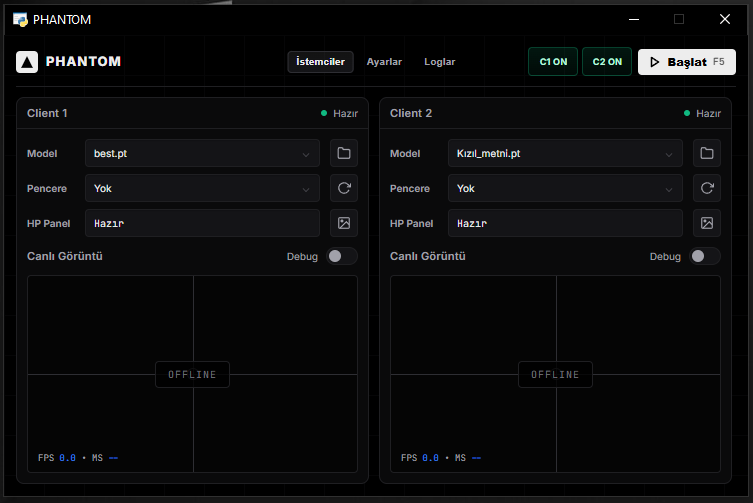
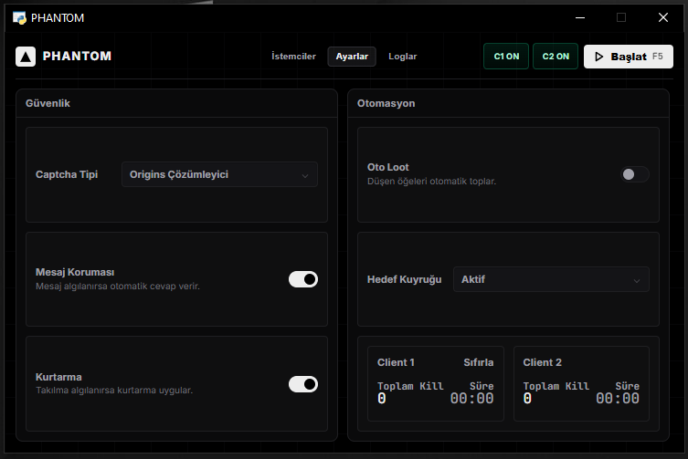

# PHANTOM — Metin2 AI Bot

> YOLO tabanlı yapay zeka destekli otomasyon botu. Otomatik hedef algılama, HP takibi, anti-stuck ve CAPTCHA çözme özellikleriyle Metin2 deneyiminizi bir üst seviyeye taşıyın.

[](https://www.python.org/)
[](https://ultralytics.com/)
[](https://www.microsoft.com/windows)
[](LICENSE)

---

## 🚀 Özellikler

- **🎯 Otomatik Hedef Algılama** — YOLO modelleri ile ekrandaki metinleri, yaratıkları ve nesneleri anlık tespit eder.
- **❤️ HP Takibi** — Oyuncu HP çubuğunu görüntü işleme ile sürekli izler, düşük HP'de bekler.
- **🛡️ Anti-Stuck Sistemi** — Karakter takıldığında otomatik olarak kurtarır.
- **🔐 CAPTCHA Çözme** — EasyOCR ile otomatik CAPTCHA tanıma ve çözümü.
- **⚡ Otomatik Loot** — Yaratık öldüğünde otomatik `Z` tuşu ile loot toplama.
- **🖥️ Web Tabanlı Arayüz** — Basit ve kullanıcı dostu HTML arayüzü ile kolay yapılandırma.
- **🔧 Kolay Yapılandırma** — İlk çalıştırmada otomatik oluşan ayar dosyası ile hızlı özelleştirme.

---

## 📸 Ekran Görüntüleri

| Bot Arayüzü | Yapılandırma ve Tespit |
|:-----------:|:----------------------:|
|  |  |

---

## ⚙️ Gereksinimler

| Bileşen | Minimum |
|---------|---------|
| İşletim Sistemi | Windows 10 / 11 (64-bit) |
| Python | 3.10, 3.11 veya 3.12 |
| GPU | Tercihen CUDA destekli (daha hızlı YOLO çıkarımı) |
| RAM | 4 GB+ |

---

## 📦 Kurulum

### 1. Python'u İndirin
[python.org](https://www.python.org/downloads/) adresinden **Python 3.10 - 3.12 (64-bit)** sürümünü indirin.  
**Kurulum sırasında `"Add Python to PATH"` seçeneğini işaretlemeyi unutmayın!**

### 2. Gerekli Kütüphaneleri Kurun

**Otomatik Kurulum (Önerilen):**
```batch
kurulum.bat
```

**Manuel Kurulum:**
```bash
pip install opencv-python numpy mss keyboard ultralytics torch pywin32 pyglet easyocr
```
> ⏳ İlk kurulum 5-15 dakika sürebilir (torch ve easyocr büyük paketlerdir).

### 3. Botu Başlatın
```batch
PHANTOM.bat
```
Yönetici yetkisi isteyebilir.

---

## 🎮 Kullanım

| Adım | Açıklama |
|------|----------|
| 1 | `PHANTOM.bat` dosyasını çalıştırın |
| 2 | YOLO model dosyasını (`.pt`) seçin |
| 3 | Metin2 oyun penceresini seçin |
| 4 | HP panel bölgesini fare ile çizin |
| 5 | Gerekirse skill, loot ve CAPTCHA ayarlarını yapın |
| 6 | **BAŞLAT** butonuna veya `F5` tuşuna basın |

---

## ⌨️ Klavye Kısayolları

| Tuş | İşlev |
|-----|-------|
| `F5` | Botu Başlat / Durdur |

---

## 🏗️ Proje Yapısı

```
PHANTOM_BOT/
├── src/
│   └── phantom/
│       ├── app/           # Ana uygulama ve arayüz
│       ├── automation/    # Otomasyon modülleri
│       ├── captcha/       # CAPTCHA çözme motoru
│       ├── core/          # Çekirdek iş mantığı
│       ├── input/         # Girdi/klavye simülasyonu
│       └── vision/        # Görüntü işleme ve YOLO entegrasyonu
├── models/                # YOLO model dosyaları (.pt)
├── templates/             # HP, CAPTCHA ve mesaj şablonları
├── runtime/               # Çalışma zamanı logları ve CAPTCHA kayıtları
├── docs/                  # Dokümantasyon ve ekran görüntüleri
├── PHANTOM.bat            # Başlatıcı
├── kurulum.bat            # Bağımlılık kurucu
├── index.html             # Web arayüzü
└── captcha_solver.py      # Bağımsız CAPTCHA modülü
```

---

## 🧠 Modeller

Bot, Ultralytics YOLOv8 modellerini kullanır. Projeye dahil olan modeller:

| Model | Amaç |
|-------|------|
| `models/Büyülü_metni.pt` | Büyülü metin algılama |
| `models/Guatama_metni.pt` | Guatama metni algılama |
| `models/Gölge_metni.pt` | Gölge metni algılama |
| `models/Kızıl_metni.pt` | Kızıl metin algılama |

**Kendi modelinizi eğitmek için:**
> `docs/Modle dosyası oluşturma.txt` dosyasına göz atın.

---

## ⚠️ Yasal Uyarı ve Sorumluluk Reddi

> Bu proje **eğitim ve araştırma amaçlıdır**. Metin2'nin ve diğer oyunların hizmet şartlarını ihlal edebilir. Yazılımın kullanımından doğacak tüm sorumluluk kullanıcıya aittir. Geliştirici, bu araçtan kaynaklanan hesap kısıtlamaları veya yasal yaptırımlardan sorumlu tutulamaz.

---

## 📄 Lisans

Bu proje [MIT Lisansı](LICENSE) ile lisanslanmıştır. Detaylar için `LICENSE` dosyasına bakınız.

---

## 💬 İletişim

Sorularınız veya katkılarınız için GitHub [Issues](https://github.com/cpu100-PHANTOM/PHANTOM-Metin2-AI-Bot/issues) bölümünü kullanabilirsiniz.

**İyi oyunlar!** 🎮
